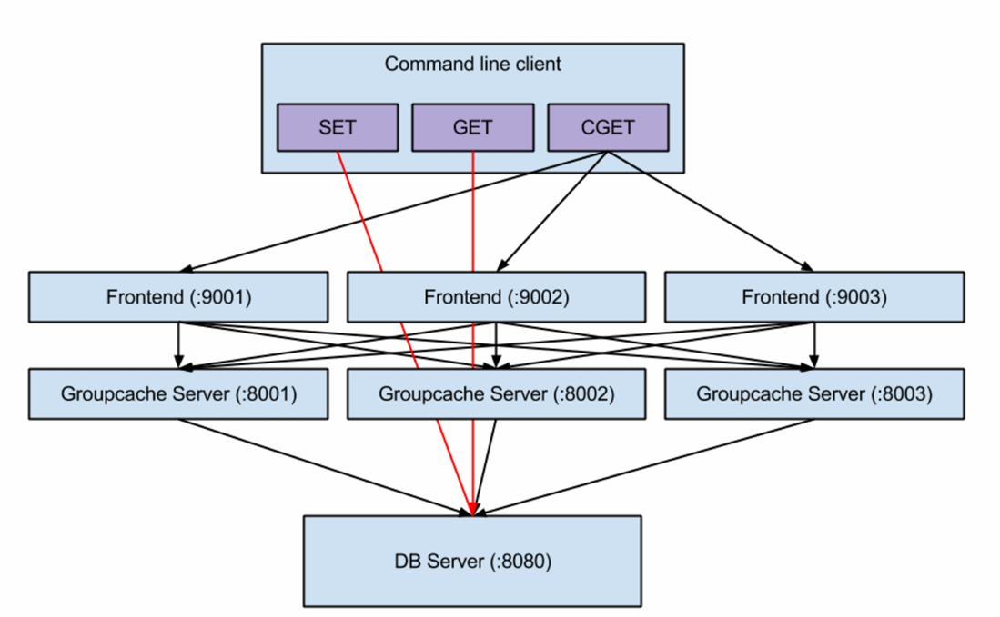

# geecache
分布式缓存系统

### Group

```bash
接收到key   --> 是否被缓存 --是--> 返回缓存值
            -
            否
            - -----> 是否从远程节点获取 ----是----> HTTP 客户端访问远程节点 --是--> 服务端返回返回值
                            -                                              -
                            -                                              -
                            否                                             否
                            -                                              -
                            -                                              -
                            - ----> 调用回调函数，获取值然后添加到缓存 ----> 返回缓存值
```
### 一致性哈希
⼀致性哈希的主要⽬的是解决缓存系统的⽔平扩展性和负载均衡问题
⼀致性哈希⽤于确定缓存数据的分⽚和分布。每个节点都负责⼀定范围的哈希键，当需要查询或存储数据时，通过⼀致性哈希可以快速定位到对应的节点。这种⽅式有效地避免了数据倾斜和热点问题，并提供了良好的负载均衡和扩展性。

一致性哈希算法将 key 映射到 2^32 的空间中，将这个数字首尾相连，形成一个环
* 计算节点/机器的哈希值放在环上
* 计算key的hash值放在环上，根据顺时针第一个节点，就是要选取的节点/机器

通过为每个物理节点创建多个虚拟节点，并将这些虚拟节点均匀地分布在哈希环上，可以更好地平衡数据的负载分布，尤其在节点数量较少的情况下。当数据量不断增⻓或节点数量不⾜以满⾜负载需求时，虚拟节点可以提供更多的灵活性，使得数据能够更加均匀地分布到不同的节点上。 


### 缓存雪崩、缓存击穿、缓存穿透
1. 缓存雪崩：缓存在同一时刻全部失效，造成瞬时DB请求量大、压力骤增，引起雪崩。缓存雪崩通常因为缓存服务器宕机、缓存的 key 设置了相同的过期时间等引起。
2. 缓存击穿：一个存在的key，在缓存过期的一刻，同时有大量的请求，这些请求都会击穿到 DB ，造成瞬时DB请求量大、压力骤增。
3. 缓存穿透：查询一个不存在的数据，因为不存在则不会写到缓存中，所以每次都会去请求 DB，如果瞬间流量过大，穿透到 DB，导致宕机。
### 应对缓存雪崩、缓存击穿
1. singleFlight : 在多个并发请求触发的回调操作⾥，只有第⼀个回调⽅法被执⾏，其余请求（落在第⼀个回调⽅法执⾏的时间窗⼝⾥）阻塞等待第⼀个回调函数执⾏完成后直接取结果，以此保证同⼀时刻只有⼀个回调⽅法执⾏，达到防⽌缓存击穿的⽬的   
2. singleFlight常用场景: 1.缓存失效时的保护性更新       2.防止突增的接口请求对后端服务造成瞬时高负债
3. 实现: 使用mutex和sync.WaitGroup实现多goroutine并发控制策略
